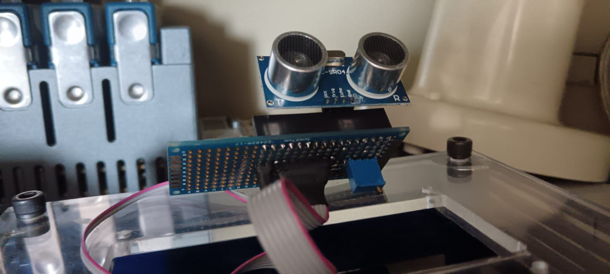
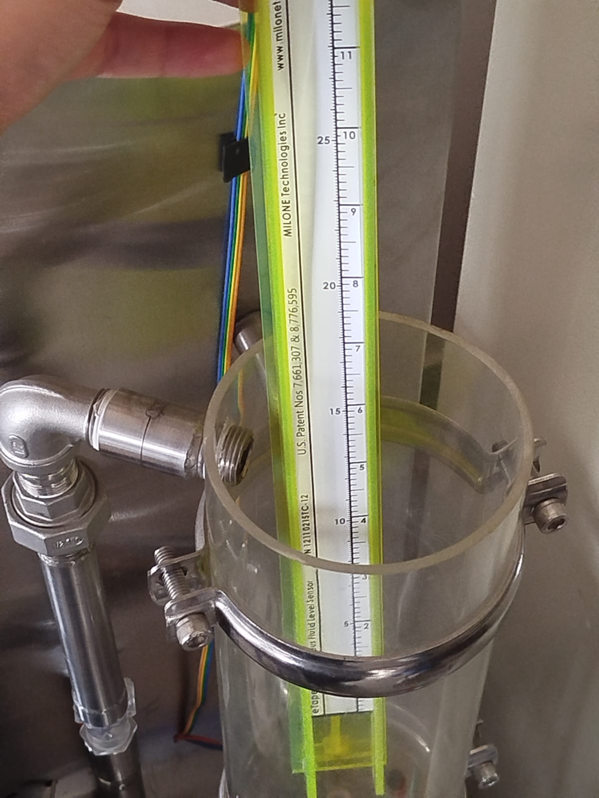
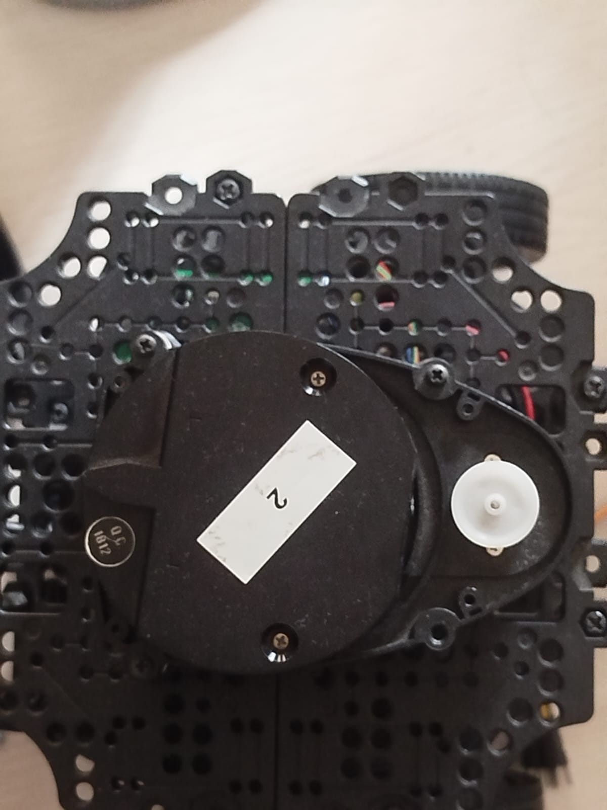
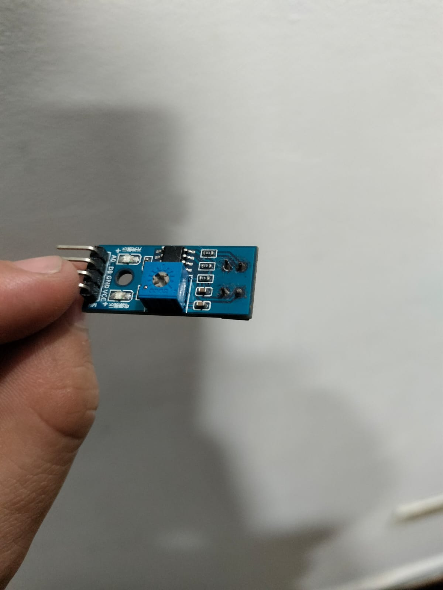

# ¿Con que sensores se cuenta en los laboratorios de la Santoto?

Los laboratorios de energias, robotica y electronica cuentan con algunos sensores ya sea pensados para la practica o proyectos creados por los mismos estudiantes, acontinuacion se describira su funcionamiento básico,  una referencia y aplicaciones.

---

## 1. Sensor ultrasónico

- **Descripción:** Emite ondas de ultrasonido y mide el tiempo que tardan en regresar al chocar con un objeto. Permite calcular la distancia.
- **Aplicaciones:** Robótica, medición de nivel de líquidos, detección de obstáculos.
- **Referencia:** [Arduino - Ultrasonic Sensor](https://www.arduino.cc/en/Tutorial/BuiltInExamples/Ping)

---

## 2. Sensor de presión de agua

- **Descripción:** Un Fluid Level Sensor es un dispositivo diseñado para detectar el nivel de un líquido dentro de un contenedor (tanques, depósitos, tuberías, etc.). Su principio de funcionamiento depende del tipo de sensor:
De flotador: Usa un flotador que sube o baja con el nivel del líquido, activando un interruptor mecánico o magnético.
Capacitivo: Detecta la variación de capacitancia entre electrodos cuando cambia la presencia de líquido.
Ultrasónico u óptico: Envía una señal (sonido o luz) y mide la reflexión para determinar si hay líquido en cierto punto.Convierte la presión del agua en una señal eléctrica proporcional. 
- **Aplicaciones:** Sistemas de bombeo, monitoreo de redes hidráulicas, electrodomésticos.
- **Referencia:** [Water Pressure Sensor](https://components101.com/sensors/water-pressure-sensor)

---

## 3. Sensor de posición

- **Descripción:** Detecta la posición angular o lineal de un objeto. Puede basarse en potenciómetros, encoders o sensores magnéticos.
- **Aplicaciones:** Control de motores, robótica, automatización industrial.
- **Referencia:** [Position Sensor Overview](https://www.elprocus.com/what-are-position-sensors-types-and-their-applications/)

---
## 4. Sensor infrarrojo 

- **Descripción:** Utiliza luz infrarroja para detectar presencia u objetos. Puede funcionar por reflexión o interrupción de haz.
- **Aplicaciones:** Control remoto, detección de obstáculos en robots, sistemas de conteo.
- **Referencia:** [IR Sensor Guide](https://lastminuteengineers.com/ir-sensor-arduino-tutorial/)
  
---
## 5. Sensor de bloqueo de puertas

- **Descripción:** Detecta si una puerta está abierta o cerrada. Puede funcionar con interruptores magnéticos (reed switch) o sensores mecánicos.
- **Aplicaciones:** Sistemas de seguridad, control de acceso, alarmas.
- **Referencia:** [Door Sensor Basics](https://components101.com/switches/magnetic-reed-switch)
